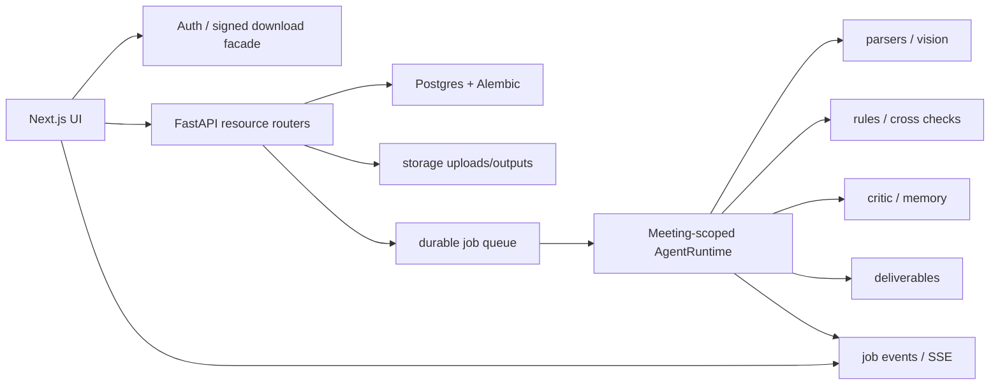

# FXPG Project Optimization Implementation Plan

> **For agentic workers:** REQUIRED SUB-SKILL: Use superpowers:subagent-driven-development (recommended) or superpowers:executing-plans to implement this plan task-by-task. Steps use checkbox (`- [ ]`) syntax for tracking.

**Goal:** Move FXPG from a strong internal prototype to a production-ready audit workflow with safe uploads, meeting-scoped analysis, reliable jobs, maintainable APIs, consistent UI, and trustworthy CI.

**Architecture:** Treat `Meeting` as the execution boundary, `Project` as the portfolio/rollup boundary, and `Job` as a durable asynchronous workflow record. Split current large files by resource and responsibility before adding broad new behavior. Keep the existing FastAPI, SQLAlchemy, Alembic, Next.js App Router, and Render/Docker deployment model.

**Tech Stack:** FastAPI, SQLAlchemy, Alembic, PostgreSQL/pgvector, Next.js 15, React 19, TypeScript, Docker, Render, pytest, ESLint, TypeScript compiler.

---

## Scope Decomposition

This is not one implementation task. It spans independent subsystems and should be executed as staged subplans:

1. Security and file IO hardening.
2. Meeting-scoped execution correctness.
3. Durable job execution and progress streaming.
4. Backend modularization and state model cleanup.
5. Test and CI stabilization.
6. Frontend information architecture and UI system consolidation.
7. Observability, deployment, and production operations.

Each phase should be merged only after its acceptance checks pass.

## Target Architecture

Core rule: a meeting run must never read, write, regenerate, or critique another meeting's files, risks, logs, outputs, or state.

## Phase 0: Baseline And Guardrails

**Files:**
- Read: `/Users/cft/Desktop/FXPG/backend/app/api/routes.py`
- Read: `/Users/cft/Desktop/FXPG/backend/app/services/agent/workflow.py`
- Read: `/Users/cft/Desktop/FXPG/backend/app/services/agent/harness/compliance_harness.py`
- Read: `/Users/cft/Desktop/FXPG/frontend/lib/api.ts`
- Modify only after phase starts: no production files in this phase unless needed for tests.

- [ ] Create branch `codex/fxpg-optimization-foundation`.
- [ ] Record current failing baseline:
  - Run: `python3 -m pytest backend/tests -q`
  - Expected current baseline: fails, including `sample_project` fixture, `fake_chat_json(domain=...)`, and SQLite lock failures.
- [ ] Install frontend dependencies in a clean environment:
  - Run: `cd frontend && npm ci`
  - Then run: `npm run build`, `npx tsc --noEmit`, `npm run lint`.
- [ ] Create a short `docs/optimization-baseline.md` with exact command outputs and known failures.
- [ ] Do not start behavior refactors until the baseline document exists.

**Acceptance:** Everyone knows which failures are pre-existing and which failures are introduced by future phases.

## Phase 1: Security And File IO Hardening

**Files:**
- Modify: `/Users/cft/Desktop/FXPG/backend/app/api/routes.py`
- Modify or create: `/Users/cft/Desktop/FXPG/backend/app/services/file_storage.py`
- Reuse: `/Users/cft/Desktop/FXPG/backend/app/services/domain/compliance/case_upload.py`
- Modify: `/Users/cft/Desktop/FXPG/frontend/lib/api.ts`
- Modify: `/Users/cft/Desktop/FXPG/frontend/app/projects/[id]/meetings/[meetingId]/outputs/page.tsx`
- Test: `/Users/cft/Desktop/FXPG/backend/tests/test_case_upload.py`
- Test: create `/Users/cft/Desktop/FXPG/backend/tests/test_file_storage_security.py`
- Test: create `/Users/cft/Desktop/FXPG/backend/tests/test_output_download_auth.py`

- [ ] Add tests proving ordinary upload rejects `../evil.pdf`, absolute paths, empty names, and unsupported extensions.
- [ ] Implement one shared filename sanitizer for all uploads. Preserve display name separately from disk name if needed.
- [ ] Store uploads under generated safe filenames, not raw client filenames.
- [ ] Make overwrite behavior explicit: either reject duplicates or suffix with a deterministic collision-safe name.
- [ ] Replace query-string API key downloads with one of:
  - preferred: `POST /outputs/{id}/signed-url` returning a short-lived token URL;
  - acceptable internal fallback: fetch blob with `X-API-Key`, then `URL.createObjectURL`.
- [ ] Remove production dependence on `NEXT_PUBLIC_API_KEY` as security. If the project remains internal-only, document that it is only an environment convenience, not authentication.
- [ ] Run targeted tests:
  - `python3 -m pytest backend/tests/test_case_upload.py backend/tests/test_file_storage_security.py backend/tests/test_output_download_auth.py -q`

**Acceptance:** No client-controlled path can escape storage; download auth works in production; API keys are not exposed as a security boundary.

## Phase 2: Meeting-Scoped Execution Correctness

**Files:**
- Modify: `/Users/cft/Desktop/FXPG/backend/app/services/agent/harness/compliance_harness.py`
- Modify: `/Users/cft/Desktop/FXPG/backend/app/services/agent/orchestrator.py`
- Modify: `/Users/cft/Desktop/FXPG/backend/app/services/agent/runtime.py`
- Modify: `/Users/cft/Desktop/FXPG/backend/app/services/agent/critic_readjudicate.py`
- Modify: `/Users/cft/Desktop/FXPG/backend/app/services/agent/workflow.py`
- Modify: `/Users/cft/Desktop/FXPG/backend/app/services/agent/pipeline_executor.py`
- Modify: `/Users/cft/Desktop/FXPG/backend/app/services/project_live_service.py`
- Test: create `/Users/cft/Desktop/FXPG/backend/tests/test_meeting_scope_isolation.py`

- [ ] Write a failing test with one project and two meetings:
  - Meeting A has file A and risk A.
  - Meeting B has file B and risk B.
  - Running Harness for A must not read file B, modify risk B, regenerate B outputs, or show B logs.
- [ ] Pass `meeting_id` into `MissionOrchestrator` from `ComplianceHarness`.
- [ ] Change `MissionOrchestrator` prior state lookup from `project.state_json` to the active meeting state when `meeting_id` is present.
- [ ] Change `PipelineExecutor.finalize()` to persist state to `meeting.state_json` when `meeting_id` is present.
- [ ] Add `meeting_id` parameter to `run_critic_readjudicate_loop()` and filter risks by meeting.
- [ ] Ensure `AgentWorkflow.regenerate_outputs_only()` reads missing docs and state from meeting when scoped.
- [ ] Run:
  - `python3 -m pytest backend/tests/test_meeting_scope_isolation.py -q`
  - `python3 -m pytest backend/tests/test_compliance_harness.py backend/tests/test_project_live_service.py -q`

**Acceptance:** A meeting run is isolated by database queries, trace logs, state JSON, outputs, and live snapshots.

## Phase 3: Durable Jobs And Progress Streaming

**Files:**
- Modify: `/Users/cft/Desktop/FXPG/backend/app/models.py`
- Add Alembic migration under `/Users/cft/Desktop/FXPG/backend/alembic/versions/`
- Replace or wrap: `/Users/cft/Desktop/FXPG/backend/app/services/jobs/worker.py`
- Modify: `/Users/cft/Desktop/FXPG/backend/app/services/harness_job_service.py`
- Modify: `/Users/cft/Desktop/FXPG/backend/app/api/routes.py`
- Modify: `/Users/cft/Desktop/FXPG/frontend/contexts/ProjectLiveContext.tsx`

- [ ] Add job fields: `scope`, `locked_by`, `locked_at`, `heartbeat_at`, `attempts`, `idempotency_key`.
- [ ] Add unique partial constraint or transactional guard so only one queued/running job exists per meeting and job type.
- [ ] Implement DB-backed lease acquisition before running a job.
- [ ] Mark stale running jobs as recoverable after heartbeat timeout.
- [ ] Add `agent_job_events` or compact event rows for progress logs.
- [ ] Add SSE endpoint for meeting progress, keeping polling as fallback.
- [ ] Update frontend provider to consume SSE and fall back to current polling when unavailable.
- [ ] Run:
  - `python3 -m pytest backend/tests/test_harness_job_service.py backend/tests/test_project_live_service.py -q`
  - Browser smoke: import one case, verify progress updates without manual refresh.

**Acceptance:** Restarting the API does not silently lose queued work; duplicate run clicks do not create duplicate active jobs; progress is near-real-time.

## Phase 4: Backend Modularization And State Cleanup

**Files:**
- Split: `/Users/cft/Desktop/FXPG/backend/app/api/routes.py`
- Split: `/Users/cft/Desktop/FXPG/backend/app/services/agent/workflow.py`
- Create package: `/Users/cft/Desktop/FXPG/backend/app/api/routers/`
- Create package: `/Users/cft/Desktop/FXPG/backend/app/services/agent/pipeline/`
- Modify: `/Users/cft/Desktop/FXPG/backend/app/main.py`

- [ ] Split routers by resource:
  - `projects.py`
  - `meetings.py`
  - `files.py`
  - `jobs.py`
  - `deliverables.py`
  - `rules.py`
  - `memories.py`
  - `harness.py`
- [ ] Keep response schemas in `schemas.py` until the split is stable.
- [ ] Introduce a state helper with two explicit hosts:
  - project rollup state;
  - meeting execution state.
- [ ] Move parsing/rules/cross-check/output methods out of `AgentWorkflow` into focused modules.
- [ ] Preserve endpoint paths during the split.
- [ ] Run existing API tests after each router extraction.

**Acceptance:** `routes.py` is no longer the central owner of all resources, endpoint behavior is unchanged, and execution state is consistently written to the correct host.

## Phase 5: Test And CI Stabilization

**Files:**
- Modify: `/Users/cft/Desktop/FXPG/backend/tests/conftest.py`
- Modify failing tests under `/Users/cft/Desktop/FXPG/backend/tests/`
- Modify: `/Users/cft/Desktop/FXPG/.github/workflows/ci.yml`
- Modify: `/Users/cft/Desktop/FXPG/frontend/next.config.js`
- Modify: `/Users/cft/Desktop/FXPG/backend/requirements.txt`
- Modify: `/Users/cft/Desktop/FXPG/backend/requirements-dev.txt`

- [ ] Make tests use isolated temp DB per test or transaction rollback.
- [ ] Add missing `sample_project` fixture.
- [ ] Update LLM mocks to accept `**kwargs`, including `domain`.
- [ ] Move `pytest` out of runtime requirements and keep it in dev requirements.
- [ ] Re-enable ESLint build blocking or add a separate required CI lint step.
- [ ] Add CI matrix:
  - backend unit tests;
  - backend critical integration tests;
  - frontend typecheck;
  - frontend lint;
  - frontend build.
- [ ] Run:
  - `python3 -m pytest backend/tests -q`
  - `cd frontend && npm run lint && npx tsc --noEmit && npm run build`

**Acceptance:** CI is green from a fresh checkout; local tests do not mutate developer data; frontend build cannot hide lint/type failures.

## Phase 6: Frontend UI And Information Architecture

**Files:**
- Modify: `/Users/cft/Desktop/FXPG/frontend/app/globals.css`
- Modify: `/Users/cft/Desktop/FXPG/frontend/app/settling-theme.css`
- Decide whether to delete or stop importing: `/Users/cft/Desktop/FXPG/frontend/app/streamline-theme.css`
- Modify key components in `/Users/cft/Desktop/FXPG/frontend/components/`
- Modify meeting pages under `/Users/cft/Desktop/FXPG/frontend/app/projects/[id]/meetings/[meetingId]/`

- [ ] Consolidate to one theme system with clear design tokens: colors, spacing, typography, table density, risk colors.
- [ ] Remove duplicate shell/table/card definitions across CSS files.
- [ ] Replace repeated inline styles with reusable utility classes or small components.
- [ ] Make audit pages evidence-first:
  - Findings page columns: level, rule, finding, evidence source, confidence, review state.
  - Outputs page: package first, then individual artifacts, then critic summary.
  - Files page: category confidence and parse status visible.
- [ ] Replace native `confirm()` destructive flows with project-styled confirmation dialogs.
- [ ] Improve empty/error/loading states for each meeting tab.
- [ ] Verify mobile table overflow and long Chinese/English text wrapping.
- [ ] Run visual smoke checks at 1440px and 390px widths.

**Acceptance:** The UI reads as a professional audit workbench, not a demo dashboard; repeated workflows are faster; long text does not overlap or break layouts.

## Phase 7: Observability And Operations

**Files:**
- Modify: `/Users/cft/Desktop/FXPG/backend/app/logging_config.py`
- Modify: `/Users/cft/Desktop/FXPG/backend/app/services/agent/agent_trace.py`
- Modify: `/Users/cft/Desktop/FXPG/docs/DEPLOY_RENDER.md`
- Modify: `/Users/cft/Desktop/FXPG/render.yaml`
- Modify scripts under `/Users/cft/Desktop/FXPG/scripts/`

- [ ] Add request ID propagation from API request to job logs.
- [ ] Add structured fields to trace logs: `project_id`, `meeting_id`, `job_id`, `step`, `duration_ms`, `error_code`.
- [ ] Add admin/debug endpoint for job health and stuck jobs, protected by auth.
- [ ] Add retention policy for uploads, staging dirs, logs, and generated outputs.
- [ ] Document recovery playbook:
  - failed LLM;
  - vision rate limit;
  - stuck job;
  - missing output;
  - Render redeploy.
- [ ] Add predeploy check that matches CI, not only two backend tests.

**Acceptance:** Operators can answer what is running, what failed, why it failed, and how to retry without reading raw database rows.

## Recommended Order

1. Phase 1 and Phase 2 first. These address security and correctness.
2. Phase 5 immediately after Phase 2. It prevents regressions during larger refactors.
3. Phase 3 before external rollout or heavier user testing.
4. Phase 4 once behavior is protected by tests.
5. Phase 6 after backend contracts stabilize.
6. Phase 7 before production handoff.

## Release Gates

- No known path traversal or raw filename write path remains.
- Meeting isolation test passes.
- Full backend pytest suite passes.
- Frontend lint, typecheck, and build pass from a clean install.
- One full FX case can be imported, analyzed, reviewed, rejected with reanalysis, accepted, and downloaded.
- Deployment guide matches actual Render behavior.
