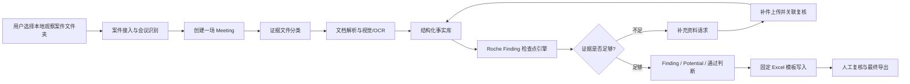

# FXPG 真 Agent 罗氏审核系统全面优化实施计划

> **给执行型 Agent 的要求：** 执行本计划时必须使用 `superpowers:subagent-driven-development`（推荐）或 `superpowers:executing-plans`。步骤使用复选框语法（`- [ ]`）跟踪。

**目标：** 将 FXPG 从“套了 Agent 名字的固定流水线原型”，改造成一个真正能处理罗氏远程观察资料包、执行 Roche Finding 审核、支持补充资料闭环、并输出固定 Excel 模板的审查智能体系统。

**架构：** 保留 `Meeting` 作为单场会议执行边界，`Project` 作为项目汇总边界；新增明确的审计领域对象：规则书、证据文件、结构化事实、检查点结果、证据缺口、补充资料请求、固定模板输出。把现有“主 Agent / 子 Agent / Skill”的角色包装，升级为有工具、有证据范围、有结构化产出、有校验器、有补件能力、有审计轨迹的真实 Agent。原先工程优化计划中的上传安全、meeting 隔离、持久化任务、测试、UI、部署等内容保留，但放在业务链路和真 Agent 能力纠偏之后。

**技术栈：** FastAPI、SQLAlchemy、Alembic、PostgreSQL/SQLite dev、openpyxl、Next.js App Router、React、TypeScript、文本 LLM、视觉/OCR 模型、pytest、ESLint、TypeScript compiler。

---

## 一、当前问题判断

之前的工程优化计划文件仍然有效：

`docs/superpowers/plans/2026-06-23-fxpg-project-optimization.md`

但那份计划默认“现有业务链路大致正确”。现在经过补充审查，可以确定这个前提不成立。因此新的优先级必须调整：先做业务模型和真 Agent 能力纠偏，再做工程加固。

当前主要问题：

- 计划和文档容易把样本 `FX/` 目录误当成固定输入；真实产品应导入用户选择的任意本地观察案件文件夹，通常一次导入一场观察案件。
- `SMS202606090070` 这种会议编码当前不能被正确识别。
- 含 `A1P` 的资料包里，短信、确认单、签到表、线上截图、议程、讲者资料等图片会被误判为 `a1_meeting_export`。
- `Roche-Finding 描述_20230520.xlsx` 没有作为审核规则书和 Finding 话术来源。
- `新建 Microsoft Excel 工作表.xlsx` 没有作为最终固定输出模板。
- 当前合规 Skill 大多只是一两句话提示词，不是真正可执行的领域 SOP。
- 当前所谓子 Agent 大多只是固定流水线步骤外面套了角色名称，不拥有独立工具、证据范围、结构化结论或补件能力。
- 没有一等的补充资料流程，但固定模板里本身存在 `EC 待跟进事项` 字段。

## 二、目标业务链路



## 三、什么才算这个项目里的“真 Agent”

FXPG 的审查 Agent 必须同时满足以下条件：

- 有明确业务职责，而不是只有 UI 名称。
- 有限定证据范围和允许调用的工具。
- 有强制结构化输出 Schema。
- 能在证据不足时生成 `SupplementRequest`。
- 每个事实和结论必须引用证据来源：`file_id`、页码/Sheet/图片、提取值。
- LLM 输出必须经过确定性校验。
- Trace 里必须记录观察、工具调用、判断、置信度、未解决缺口。

只执行固定流水线并记录一个角色名的，只能叫 worker，不能叫 Agent。

## 四、目标 Agent 体系

1. **Orchestrator Agent / 编排 Agent**
   - 负责审查计划、Agent 调度、停止条件、补件判断、最终就绪判断。
   - 不直接编造 Finding，而是协调各专门 Agent 并校验完整性。

2. **Case Intake Agent / 案件接入 Agent**
   - 接收用户选择的本地单场观察案件文件夹。
   - 识别会议编码、观察类型、来源文件夹、资料完整性。
   - 可选支持批量根目录识别，但不能把 `FX/` 样本目录写成产品默认输入。

3. **Evidence Classification Agent / 证据分类 Agent**
   - 对文件做业务证据分类。
   - 必须支持 A1 导出、SMS 资料、议程、确认单、沟通短信、签到表、Zoom 截图、直播端截图、观看数据、最大端口数、赞助回报、其他厂家、讲者网络资料、PPT/材料、日程更新邮件。

4. **Plan Facts Agent / 计划信息 Agent**
   - 从 A1/SMS/计划资料中提取会议计划信息。
   - 负责计划日期、时间、地点、预算、申请人、组织者、讲者/主席、参会人数、产品、讲题、材料性质。

5. **Remote Evidence Agent / 远程观察证据 Agent**
   - 读取线上截图、沟通短信、确认单、观察证据。
   - 负责实际开始/结束/离会时间、截图覆盖、线上平台、组织者配合程度、是否成功观察。

6. **Attendance Agent / 参会与签到 Agent**
   - 读取签到表、平台参会姓名、直播观看数据、最大参会人数、Roche 员工、可疑参会人员。
   - 负责人数和身份一致性检查。

7. **Speaker And Material Agent / 讲者与材料 Agent**
   - 读取讲者资料、PPT 截图、确认单、议程。
   - 负责讲者身份、付费服务时长、PPT 主题/编码/页数、推广/非推广材料一致性。

8. **Policy Rule Agent / 政策规则 Agent**
   - 基于 Roche-Finding 规则书和事实库执行检查。
   - 输出 `CheckResult`：`pass`、`finding`、`potential_finding`、`needs_supplement`、`not_applicable`。

9. **Supplement Agent / 补充资料 Agent**
   - 将证据缺口转成可执行补件请求。
   - 将补充上传文件关联回请求，并触发定向复核。

10. **Template Output Agent / 模板输出 Agent**
    - 将事实和检查点结果写入固定 Excel 模板。
    - 必须保留模板格式，只写入目标数据行。

11. **Critic / QA Agent / 质检 Agent**
    - 校验证据引用、规则到模板映射、无来源断言、是否需要写入 `EC 待跟进事项`。

## 五、目标后端文件结构

建议新增或修改以下模块：

- 新建：`backend/app/services/domain/compliance/case_package.py`
  - 负责本地观察案件文件夹识别、会议编码推断、资料完整性检查；批量拆分只作为可选扩展。
- 新建：`backend/app/services/domain/compliance/evidence_types.py`
  - 负责标准证据类型枚举和中文标签。
- 新建：`backend/app/services/domain/compliance/evidence_classifier.py`
  - 负责基于文件名、路径、文本、OCR 的证据分类。
- 新建：`backend/app/services/domain/compliance/rulebook_loader.py`
  - 负责解析 `Roche-Finding 描述_20230520.xlsx`。
- 新建：`backend/app/services/domain/compliance/template_schema.py`
  - 负责解析 `新建 Microsoft Excel 工作表.xlsx` 的表头和列映射。
- 新建：`backend/app/services/domain/compliance/fact_schema.py`
  - 负责结构化事实 key、类型、来源引用格式。
- 新建目录：`backend/app/services/domain/compliance/fact_extractors/`
  - 包含 `a1_export.py`、`sms_case.py`、`attendance_live_data.py`、`confirmation.py`、`agenda.py`、`screenshots.py`、`speaker_material.py`。
- 新建：`backend/app/services/domain/compliance/check_engine.py`
  - 负责事实 + 规则书 -> 检查点结果和证据缺口。
- 新建：`backend/app/services/domain/compliance/template_writer.py`
  - 负责使用 openpyxl 写固定 Excel 模板。
- 新建：`backend/app/services/domain/compliance/supplements.py`
  - 负责补充资料请求生命周期和定向复核。
- 新建目录：`backend/app/services/agent/audit_agents/`
  - 包含 `base.py`、`orchestrator.py`、`case_intake.py`、`evidence_classification.py`、`plan_facts.py`、`remote_evidence.py`、`attendance.py`、`speaker_material.py`、`policy_rule.py`、`supplement.py`、`template_output.py`、`critic.py`。
- 新建目录：`backend/app/services/agent/prompts/`
  - 集中管理系统提示词、Agent SOP、任务提示词、修复提示词和 few-shot 样例，禁止继续把关键提示词散落在业务代码字符串里。
- 修改：`backend/app/models.py`
  - 新增审计事实、检查点结果、证据缺口、补件请求、审计运行记录。
- 修改：`backend/app/api/routes.py`
  - 在合约稳定后拆分为多个 router。
- 修改：`frontend/app/projects/[id]/meetings/[meetingId]/`
  - 增加审计工作台页面。

## 六、阶段 0：Golden Cases 与基线冻结

**目的：** 在重构前先冻结真实业务预期。

**文件：**
- 读取：`FX/Remote_A1P260307357_20260506_Luo, Amy Yun_Supporting/`
- 读取：`FX/Remote_SMS202606090070_20260615_Lei, Lily Yuli_Supporting/`
- 读取：`FX/Roche-Finding 描述_20230520.xlsx`
- 读取：`FX/新建 Microsoft Excel 工作表.xlsx`
- 新建：`backend/tests/fixtures/compliance_golden_cases.py`
- 新建：`docs/fxpg-business-requirements.md`

步骤：

- [ ] 记录真实输入输出合约：
  - 一个资料包文件夹等于一场会议。
  - Roche-Finding workbook 是规则书和话术来源。
  - 固定 Excel workbook 是最终输出模板。
  - `EC 待跟进事项` 表示未解决证据缺口。
  - `EE Potential Finding` 表示需要记录但不作为正式 Finding 的事项。

- [ ] 写 golden-case inventory 测试。

运行：

```bash
python3 -m pytest backend/tests/test_compliance_golden_inventory.py -q
```

预期：测试先失败，证明当前系统不能正确识别 SMS 案件，并且当前文档/入口对样本 `FX/` 与真实本地单场案件输入的边界不清。

- [ ] 记录当前命令基线：

```bash
python3 -m pytest backend/tests -q
cd frontend && npm run lint && npx tsc --noEmit && npm run build
```

预期：将确切失败记录到 `docs/optimization-baseline.md`，后续阶段不能把既有失败误判为新回归。

## 七、阶段 1：审计领域数据模型

**目的：** 停止只用松散 `state_json` 和通用 `Risk` 承载审查过程。

**文件：**
- 修改：`backend/app/models.py`
- 新建：`backend/alembic/versions/00x_compliance_audit_domain.py`
- 修改：`backend/app/schemas.py`
- 新建：`backend/tests/test_compliance_audit_models.py`

新增实体：

- `AuditFact`
  - `id`、`project_id`、`meeting_id`、`fact_key`、`fact_value_json`、`source_json`、`confidence`、`agent_id`、`created_at`。
- `AuditCheckResult`
  - `id`、`project_id`、`meeting_id`、`check_id`、`category`、`check_point`、`status`、`template_column`、`finding_text`、`evidence_json`、`confidence`、`agent_id`。
- `EvidenceGap`
  - `id`、`project_id`、`meeting_id`、`check_id`、`fact_key`、`reason`、`required_evidence_type`、`status`。
- `SupplementRequest`
  - `id`、`project_id`、`meeting_id`、`gap_id`、`title`、`reason`、`expected_evidence_type`、`status`、`uploaded_file_ids_json`、`review_note`、`created_at`、`resolved_at`。
- `AuditRun`
  - `id`、`project_id`、`meeting_id`、`status`、`mode`、`started_at`、`finished_at`、`agent_trace_json`。

步骤：

- [ ] 写测试：创建一场 meeting，插入 facts、check results、gaps、supplement requests。
- [ ] 添加 Alembic migration。
- [ ] 用 SQLite 跑模型测试。
- [ ] 跑现有后端测试并记录新增失败。

## 八、阶段 2：本地观察案件文件夹导入

**目的：** 让输入处理匹配真实使用方式：用户选择一个本地观察案件文件夹，一次导入一场观察案件；`FX/` 目录只作为样本和测试数据来源。

**文件：**
- 新建：`backend/app/services/domain/compliance/case_package.py`
- 修改：`backend/app/services/domain/compliance/case_loader.py`
- 修改：`backend/app/services/domain/compliance/case_upload.py`
- 修改：`backend/app/api/routes.py`
- 新建：`backend/tests/test_compliance_case_package.py`

必须实现：

- 导入任意单场观察案件文件夹时，只生成一场会议。
- 分别导入两个样本资料包时，会议编码应为：
  - `A1P260307357`
  - `SMS202606090070`
- 会议编码识别支持：
  - `A1P\d+`
  - `SMS\d+`
  - 后续可通过一个函数扩展其他编码模式。
- Roche 规则书和固定模板属于系统配置/模板资源，不能被当成会议证据文件。
- 浏览器上传本地文件夹时保留相对路径，但默认按单场 meeting 导入。
- 如果用户选择的是包含多个案件文件夹的批量根目录，应提示用户选择具体案件或进入明确的批量导入模式；不能静默混成一场会议。

验收命令：

```bash
python3 -m pytest backend/tests/test_compliance_case_package.py -q
```

预期：测试通过，数据库里每次单场案件导入只创建一场 meeting；两个样本案件分别导入时编码正确。

## 九、阶段 3：证据分类

**目的：** 用 Roche 业务证据分类替代当前粗糙的文件名关键词分类。

**文件：**
- 新建：`backend/app/services/domain/compliance/evidence_types.py`
- 新建：`backend/app/services/domain/compliance/evidence_classifier.py`
- 修改：`backend/app/services/domain/compliance/classifier.py`
- 修改：`backend/app/services/agent/domain_classify.py`
- 新建：`backend/tests/test_compliance_evidence_classifier.py`

标准分类：

- `a1_meeting_export`
- `sms_case_material`
- `meeting_agenda`
- `schedule_update_email`
- `observation_confirmation`
- `coordination_sms`
- `sign_in_record`
- `online_screenshot_zoom`
- `online_screenshot_live`
- `max_port_screenshot`
- `live_viewing_data`
- `presentation_material`
- `speaker_profile`
- `sponsor_return`
- `other_company_evidence`
- `meal_evidence`
- `unknown`

验收样例：

- `Remote_A1P260307357_20260506_沟通短信 (1).jpg` -> `coordination_sms`，不能是 `a1_meeting_export`。
- `Remote_A1P260307357_20260506_签到表 (1).jpg` -> `sign_in_record`。
- `Remote_SMS202606090070_20260615_线上直播观看数据.xlsx` -> `live_viewing_data`。
- `Remote_SMS202606090070_20260615_最大端口数_zoom端 (1).jpg` -> `max_port_screenshot`。
- `Remote_SMS202606090070_20260615_赞助回报_专题会.jpg` -> `sponsor_return`。

验收命令：

```bash
python3 -m pytest backend/tests/test_compliance_evidence_classifier.py -q
```

## 十、阶段 4：Roche 规则书加载器

**目的：** 将 `Roche-Finding 描述_20230520.xlsx` 作为检查点分类和话术来源。

**文件：**
- 新建：`backend/app/services/domain/compliance/rulebook_loader.py`
- 新建：`backend/app/services/domain/compliance/rulebook_models.py`
- 新建：`backend/tests/test_roche_rulebook_loader.py`

实现要求：

- 解析 Sheet `发现点`。
- 保留：
  - `category`
  - `check_point_cn`
  - onsite wording
  - remote wording
  - Excel 行号
- 规范化分类：
  - `Inconsistent Information of Participants`
  - `Unsuccessful Observation`
  - `Breach of Policy`
  - `Other Risk Factors`
  - `Potential Finding`
  - `待跟进事项`
- 当前 7 条 CMP JSON 规则只能作为过渡规则，不能继续作为唯一规则书。

验收命令：

```bash
python3 -m pytest backend/tests/test_roche_rulebook_loader.py -q
```

预期：

- 加载器能返回 workbook 中所有有效检查点。
- Remote wording 可读取。
- 说明行被忽略。

## 十一、阶段 5：固定模板 Schema

**目的：** 把 `新建 Microsoft Excel 工作表.xlsx` 变成可校验的输出合约。

**文件：**
- 新建：`backend/app/services/domain/compliance/template_schema.py`
- 新建：`backend/tests/test_compliance_template_schema.py`

实现要求：

- 解析合并表头分组。
- 校验模板有 143 列。
- 根据第二行表头定位列。
- 为关键列建立稳定 alias：
  - `observation_type` -> A
  - `observation_success` -> B
  - `meeting_code` -> F
  - 计划信息 -> H-AE
  - 实际情况 -> AF-BW
  - 检查点 flags -> CJ-DZ
  - `feedback_type` -> EA
  - `finding_summary` -> EB
  - `follow_up_items` -> EC
  - `potential_finding` -> EE
  - `observer_name` -> EH

验收命令：

```bash
python3 -m pytest backend/tests/test_compliance_template_schema.py -q
```

预期：核心列都能解析；缺少必需列时快速失败。

## 十二、阶段 6：结构化事实抽取

**目的：** 在任何 LLM 结论前，先建立带来源引用的事实库。

**文件：**
- 新建：`backend/app/services/domain/compliance/fact_schema.py`
- 新建目录：`backend/app/services/domain/compliance/fact_extractors/`
- 新建：`backend/app/services/domain/compliance/fact_extractors/live_viewing_data.py`
- 新建：`backend/app/services/domain/compliance/fact_extractors/confirmation.py`
- 新建：`backend/app/services/domain/compliance/fact_extractors/agenda.py`
- 新建：`backend/app/services/domain/compliance/fact_extractors/a1_export.py`
- 新建：`backend/app/services/domain/compliance/fact_extractors/screenshots.py`
- 新建：`backend/app/services/domain/compliance/fact_extractors/speaker_material.py`
- 新建：`backend/tests/test_compliance_fact_extractors.py`

事实格式：

```json
{
  "fact_key": "actual.start_time",
  "value": "2026-06-15T14:00:00",
  "source": {
    "file_id": "uuid",
    "file_name": "Remote_SMS202606090070_20260615_会议日程.jpg",
    "page": null,
    "sheet": null,
    "cell": null,
    "bbox": null
  },
  "confidence": 0.82,
  "agent_id": "remote_evidence"
}
```

关键要求：

- `live_viewing_data.xlsx` 必须读取 Sheet `观看记录详情`，以第 2 行为表头，并计算：
  - 唯一观看人数
  - 最大并发或可用参会人数代理值
  - 登录时长分布
  - 医院/科室字段
- 确认单图片必须抽取：
  - 是否成功观察
  - 实际时间
  - 讲者服务时长
  - 组织者解释
- 截图解析必须区分 Zoom 端和直播端。

验收命令：

```bash
python3 -m pytest backend/tests/test_compliance_fact_extractors.py -q
```

## 十三、阶段 6.5：系统提示词工程与 Agent SOP

**目的：** 建立可版本化、可测试、可复用的提示词体系，避免“你是某某 Agent”这种散落式提示词继续伪装成智能体能力。

**文件：**
- 新建：`backend/app/services/agent/prompts/__init__.py`
- 新建：`backend/app/services/agent/prompts/registry.py`
- 新建：`backend/app/services/agent/prompts/models.py`
- 新建：`backend/app/services/agent/prompts/templates/orchestrator.system.md`
- 新建：`backend/app/services/agent/prompts/templates/case_intake.system.md`
- 新建：`backend/app/services/agent/prompts/templates/evidence_classification.system.md`
- 新建：`backend/app/services/agent/prompts/templates/plan_facts.system.md`
- 新建：`backend/app/services/agent/prompts/templates/remote_evidence.system.md`
- 新建：`backend/app/services/agent/prompts/templates/attendance.system.md`
- 新建：`backend/app/services/agent/prompts/templates/speaker_material.system.md`
- 新建：`backend/app/services/agent/prompts/templates/policy_rule.system.md`
- 新建：`backend/app/services/agent/prompts/templates/supplement.system.md`
- 新建：`backend/app/services/agent/prompts/templates/template_output.system.md`
- 新建：`backend/app/services/agent/prompts/templates/critic.system.md`
- 新建：`backend/app/services/agent/prompts/templates/repair_invalid_json.user.md`
- 新建：`backend/app/services/agent/prompts/templates/repair_unsupported_claim.user.md`
- 新建目录：`backend/app/services/agent/prompts/examples/`
- 新建：`backend/tests/test_prompt_registry.py`
- 新建：`backend/tests/test_prompt_quality_contracts.py`

提示词分层：

- `System Prompt`
  - 定义 Agent 身份、职责边界、不能做什么、证据引用要求、输出格式要求。
- `Developer/SOP Prompt`
  - 定义 Roche 审核 SOP：资料如何看、事实如何引用、何时补件、如何区分正式 Finding / Potential Finding / 待跟进事项。
- `Task Prompt`
  - 每次运行时注入当前 meeting、可用证据、目标检查点、工具清单。
- `Tool Result Prompt`
  - 规范工具返回内容如何被 Agent 消化，避免把工具输出当成无条件事实。
- `Repair Prompt`
  - 当 JSON 无效、缺少引用、出现无证据断言、模板列映射错误时，要求模型修复。

核心系统提示词要求：

- Orchestrator Agent：
  - 只能调度，不直接编造 Finding。
  - 如果缺少阻塞证据，必须生成补件请求并停止在 `needs_supplement`。
  - 必须保证每个下游 Agent 输出经过 validator。
- Evidence Classification Agent：
  - 必须优先依据文件路径/文件名/文本/OCR 证据分类。
  - 不能因为文件名含 `A1P` 就覆盖真实业务证据类型。
- Fact Agents：
  - 每个事实必须包含来源引用。
  - 无法确认时输出 evidence gap，不允许猜测。
- Policy Rule Agent：
  - 必须基于 Roche rulebook 和 fact store 判断。
  - 不得创造规则书以外的正式检查点。
- Supplement Agent：
  - 必须把证据缺口转成具体可执行的补件请求。
  - 每条补件请求必须说明影响哪个检查点、需要什么材料、为什么现有证据不足。
- Template Output Agent：
  - 必须使用 template schema 写列。
  - 不得凭自然语言猜列。
- Critic Agent：
  - 必须拦截无来源断言、规则错配、模板列错配、应补件却硬判通过。

输出协议：

```json
{
  "agent_id": "policy_rule",
  "status": "completed",
  "facts": [],
  "check_results": [],
  "evidence_gaps": [],
  "supplement_requests": [],
  "citations": [],
  "confidence": 0.0
}
```

few-shot 样例必须覆盖：

- A1P 单场远程观察资料包。
- SMS 单场赞助会资料包。
- `线上直播观看数据.xlsx` 如何作为参会证据。
- 证据不足时如何生成 `EC 待跟进事项`，而不是硬判通过。
- Potential Finding 如何写入 `EE`，而不是正式 flag。
- 正式 Finding 如何映射 CJ-DZ。

Prompt Registry 要求：

- 每个 prompt 有 `prompt_id`、`agent_id`、`version`、`template_path`、`required_variables`、`output_schema`。
- prompt 加载失败时不得 fallback 到一句“你是 Agent”。
- prompt 修改必须能通过单测检查必需变量、输出 schema、禁止词和证据引用协议。

验收命令：

```bash
python3 -m pytest backend/tests/test_prompt_registry.py backend/tests/test_prompt_quality_contracts.py -q
```

预期：

- 每个目标 Agent 都有独立 system prompt。
- 每个 prompt 都能从 registry 加载。
- 每个 prompt 都声明输出 schema。
- 缺少证据引用协议的 prompt 会测试失败。
- 关键 Agent prompt 都包含“证据不足必须生成补件请求，不能猜测或硬判通过”的约束。

## 十四、阶段 7：真 Agent Runtime

**目的：** 用有合约的 Agent 替换角色名包装。

**文件：**
- 新建：`backend/app/services/agent/audit_agents/base.py`
- 新建：`backend/app/services/agent/audit_agents/tools.py`
- 新建：`backend/app/services/agent/audit_agents/orchestrator.py`
- 新建各专门 Agent 模块。
- 修改：`backend/app/services/agent/harness/compliance_harness.py`
- 新建：`backend/tests/test_audit_agent_contracts.py`
- 新建：`backend/tests/test_audit_orchestrator_flow.py`

必要接口：

```python
class AuditAgentOutput(TypedDict):
    agent_id: str
    status: Literal["completed", "needs_supplement", "failed"]
    facts: list[dict]
    check_results: list[dict]
    evidence_gaps: list[dict]
    supplement_requests: list[dict]
    confidence: float
    citations: list[dict]
```

每个 Agent 必须：

- 接收 `AgentContext(project_id, meeting_id, run_id, allowed_evidence_types)`。
- 使用工具读取证据、事实、规则书和历史输出。
- 返回 `AuditAgentOutput`。
- 如果输出没有来源引用，却包含实质结论，必须被 validator 拒绝。

Orchestrator 流程：

1. 观察案件资料清单。
2. 调度接入和分类 Agent。
3. 按证据可用性调度事实抽取 Agent。
4. 调度政策规则 Agent。
5. 如果存在证据缺口，创建补件请求，并以 `needs_supplement` 停止。
6. 如果没有阻塞缺口，调度模板输出 Agent 和 Critic。
7. 如果 Critic 不通过，执行修复或进入人工复核。

验收命令：

```bash
python3 -m pytest backend/tests/test_audit_agent_contracts.py backend/tests/test_audit_orchestrator_flow.py -q
```

## 十五、阶段 8：检查点引擎与 Finding 决策

**目的：** 将事实转换成通过、正式 Finding、Potential Finding、补件、不可适用等判断。

**文件：**
- 新建：`backend/app/services/domain/compliance/check_engine.py`
- 新建：`backend/app/services/domain/compliance/check_mapping.py`
- 修改：`backend/app/services/domain/compliance/finding_generator.py`
- 新建：`backend/tests/test_compliance_check_engine.py`

检查点状态：

- `pass`
- `finding`
- `potential_finding`
- `needs_supplement`
- `not_applicable`

规则：

- 正式 Finding 必须映射到 CJ-DZ 对应 flag 列。
- Potential Finding 必须写入 `EE Potential Finding`。
- 证据不足必须写入 `EC 待跟进事项`。
- 任一正式检查点 flag 为 `1` 时，`DZ 是否问题会议` 为 `1`，否则为 `0`。
- `EB 观察点汇总` 必须列出选中的 Finding 标题，不能只写泛泛描述。

验收命令：

```bash
python3 -m pytest backend/tests/test_compliance_check_engine.py -q
```

## 十六、阶段 9：补充资料闭环

**目的：** 让补充资料成为一等流程，而不是普通追加上传。

**文件：**
- 新建：`backend/app/services/domain/compliance/supplements.py`
- 修改：`backend/app/api/routes.py` 或新建 `backend/app/api/routers/supplements.py`
- 修改：`frontend/lib/api.ts`
- 新建：`frontend/app/projects/[id]/meetings/[meetingId]/supplements/page.tsx`
- 修改：`frontend/components/ProjectRail.tsx`
- 新建：`backend/tests/test_supplement_requests.py`

API：

- `GET /projects/{project_id}/meetings/{meeting_id}/supplements`
- `POST /projects/{project_id}/meetings/{meeting_id}/supplements`
- `POST /projects/{project_id}/meetings/{meeting_id}/supplements/{request_id}/files`
- `POST /projects/{project_id}/meetings/{meeting_id}/supplements/{request_id}/resolve`
- `POST /projects/{project_id}/meetings/{meeting_id}/supplements/recheck`

UI：

- 增加 `补充资料` Tab。
- 每条请求显示：
  - 需补充事项
  - 原因
  - 影响的检查点
  - 预期证据类型
  - 当前状态
  - 已上传文件
  - 复核结果
- Findings / 检查点页面必须能跳转到关联补件请求。

验收命令：

```bash
python3 -m pytest backend/tests/test_supplement_requests.py -q
cd frontend && npx tsc --noEmit
```

## 十七、阶段 10：固定模板输出

**目的：** 生成真正要求的 Excel 输出。

**文件：**
- 新建：`backend/app/services/domain/compliance/template_writer.py`
- 修改：`backend/app/services/outputs/compliance_deliverables.py`
- 修改：`frontend/lib/domain.ts`
- 新建：`backend/tests/test_compliance_template_writer.py`

实现要求：

- 写入前复制模板 workbook。
- 保留 sheet 名、合并单元格、样式、列宽、行高。
- 每场 meeting 写入一行。
- 写入：
  - A-G 观察基础信息
  - H-AE 会议计划信息
  - AF-BW 会议实际情况
  - CJ-DZ 检查点 flags
  - EA 反馈类型
  - EB 观察点汇总
  - EC 未解决待跟进事项
  - EE Potential Finding
  - EH 观察员名字
- 注册输出类型 `fixed_template_excel`。
- 旧 PDF/ZIP 输出保留为可选，不再是主交付物。

验收命令：

```bash
python3 -m pytest backend/tests/test_compliance_template_writer.py -q
```

预期：输出 workbook 可打开，仍为 143 列，保留模板格式，并且两个 golden cases 的关键列写入正确。

## 十八、阶段 11：审计工作台 UI

**目的：** 将 demo dashboard 改成真正的审计作业台。

**文件：**
- 修改：`frontend/app/projects/[id]/meetings/[meetingId]/layout.tsx`
- 新建：`frontend/app/projects/[id]/meetings/[meetingId]/facts/page.tsx`
- 新建：`frontend/app/projects/[id]/meetings/[meetingId]/checks/page.tsx`
- 新建：`frontend/app/projects/[id]/meetings/[meetingId]/supplements/page.tsx`
- 修改：`frontend/app/projects/[id]/meetings/[meetingId]/files/page.tsx`
- 修改：`frontend/app/projects/[id]/meetings/[meetingId]/risks/page.tsx`
- 修改：`frontend/app/projects/[id]/meetings/[meetingId]/outputs/page.tsx`
- 修改：`frontend/lib/i18n/zh.ts`
- 修改：`frontend/app/globals.css`

导航：

- `资料`
- `事实`
- `检查点`
- `补充资料`
- `模板输出`
- `运行日志`

UI 要求：

- 证据优先，表格紧凑。
- 长中文 Finding 文本必须正确换行。
- 检查点行展示状态、映射模板列、证据、置信度、补件状态。
- 模板输出页将 `fixed_template_excel` 作为主导出。
- 不再把大面积 Agent 展示面板作为主内容。

验收命令：

```bash
cd frontend
npx tsc --noEmit
npm run lint
npm run build
```

人工冒烟：

- 分别导入两个样本 cases。
- 运行审计。
- 打开检查点页面。
- 创建补件请求。
- 上传补件文件。
- 复核。
- 下载固定 Excel。

## 十九、阶段 12：合并原工程优化计划

**目的：** 在业务链路正确后，再执行原计划里的工程加固。

本阶段吸收旧计划 `2026-06-23-fxpg-project-optimization.md` 的内容。

### 12.1 上传安全与文件 IO

**文件：**
- 修改：`backend/app/api/routes.py`
- 新建：`backend/app/services/file_storage.py`
- 修改：`frontend/lib/api.ts`
- 新建：`backend/tests/test_file_storage_security.py`
- 新建：`backend/tests/test_output_download_auth.py`

要求：

- 拒绝 `../evil.pdf`、绝对路径、空文件名。
- 磁盘使用安全生成文件名。
- 展示名与存储名分离。
- 下载鉴权不能依赖 query-string API key；改为短期签名 URL 或带鉴权头的 blob fetch。

### 12.2 Meeting 级执行隔离

**文件：**
- 修改：`backend/app/services/agent/harness/compliance_harness.py`
- 修改：`backend/app/services/agent/orchestrator.py`
- 修改：`backend/app/services/agent/runtime.py`
- 修改：`backend/app/services/agent/critic_readjudicate.py`
- 新建：`backend/tests/test_meeting_scope_isolation.py`

要求：运行一场 meeting 时，不能读取、修改、重新生成、质检另一场 meeting 的文件、事实、检查点、补件、输出、日志或状态。

### 12.3 持久化任务与进度

**文件：**
- 修改：`backend/app/models.py`
- 修改：`backend/app/services/jobs/worker.py`
- 修改：`backend/app/services/harness_job_service.py`
- 新建：`backend/tests/test_harness_job_durability.py`

要求：

- DB-backed lease。
- 每场 meeting / 每种 run type 同时只能有一个 active job。
- stale job 可恢复。
- 记录进度事件。
- 提供 SSE endpoint，并保留 polling fallback。

### 12.4 后端模块化

**文件：**
- 拆分：`backend/app/api/routes.py`
- 新建：`backend/app/api/routers/projects.py`
- 新建：`backend/app/api/routers/meetings.py`
- 新建：`backend/app/api/routers/files.py`
- 新建：`backend/app/api/routers/audit_runs.py`
- 新建：`backend/app/api/routers/supplements.py`
- 新建：`backend/app/api/routers/outputs.py`

要求：保持现有 endpoint path 不变，同时降低 `routes.py` 的体积和职责混乱。

### 12.5 测试与 CI

**文件：**
- 修改：`backend/tests/conftest.py`
- 修改：`.github/workflows/ci.yml`
- 修改：`frontend/next.config.js`

CI 必须运行：

```bash
python3 -m pytest backend/tests -q
cd frontend && npm run lint && npx tsc --noEmit && npm run build
```

### 12.6 可观测性与运维

**文件：**
- 修改：`backend/app/logging_config.py`
- 修改：`backend/app/services/agent/agent_trace.py`
- 修改：`docs/DEPLOY_RENDER.md`
- 修改：`render.yaml`

要求：

- 每条 job log 有 request ID 和 run ID。
- Agent trace 记录观察事实、工具调用、判断、校验失败。
- 上传、输出、staging、trace 有保留策略。
- 文档化 LLM 失败、视觉失败、任务卡住、输出缺失、补件复核失败的恢复流程。

## 二十、阶段 13：Agent 评估与质量门禁

**目的：** 不能把“LLM 跑过了”当成成功。

**文件：**
- 新建：`backend/tests/test_agent_evaluation_golden_cases.py`
- 新建：`backend/app/services/agent/evaluation.py`
- 新建：`docs/agent-quality-gates.md`

质量门禁：

- 没有证据引用，不能生成 Finding 文本。
- 没有 Roche 检查点映射，不能成为正式 Finding。
- 没有 `AuditCheckResult`，不能写模板 flag。
- 存在阻塞 `EvidenceGap` 时，不能判定通过。
- 必需模板列无法解析时，不能生成输出。
- Critic 必须拦截无来源断言。

Golden-case 验收：

```bash
python3 -m pytest backend/tests/test_agent_evaluation_golden_cases.py -q
```

预期：

- A1P case 导入为 `A1P260307357`。
- SMS case 导入为 `SMS202606090070`。
- `live_viewing_data.xlsx` 被解析为参会证据。
- 输出 workbook 每场会议一行。
- 未解决证据缺口写入 `EC`。

## 二十一、推荐执行顺序

1. 先做阶段 0：冻结真实业务需求和 golden case。
2. 阶段 1-3：数据模型、案件导入、证据分类。
3. 阶段 4-6：Roche 规则书、固定模板 schema、事实抽取。
4. 阶段 6.5：系统提示词工程与 Agent SOP。
5. 阶段 7-8：真 Agent runtime 和检查点决策。
6. 阶段 9-10：补件闭环和固定模板输出。
7. 阶段 11：审计工作台 UI。
8. 阶段 12：执行原工程优化计划中的安全、任务、隔离、CI、可观测性。
9. 阶段 13：持续 Agent 质量门禁。

## 二十二、发布门禁

- 导入任意本地单场观察案件文件夹时只创建一场 meeting；样本 `FX/` 不能被硬编码为固定输入。
- 两个会议编码正确：`A1P260307357`、`SMS202606090070`。
- Roche-Finding workbook 被解析并提供给政策规则 Agent。
- 每个核心 Agent 都有版本化 system prompt、输出 schema、证据引用协议和补件约束。
- 固定 Excel 模板是主输出。
- 补件请求可以创建、上传、复核，并反映到 `EC 待跟进事项`。
- 每条 Finding 都有证据引用。
- 无来源的 LLM 断言不能通过 Critic。
- 后端测试全部通过。
- 前端 lint、typecheck、build 通过。
- 能从上传资料包到下载最终固定 Excel 完成一整条审核链路。
