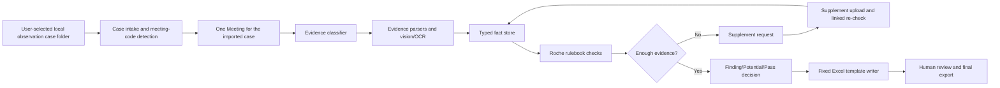

# FXPG True Agent Roche Audit Optimization Implementation Plan

> **For agentic workers:** REQUIRED SUB-SKILL: Use superpowers:subagent-driven-development (recommended) or superpowers:executing-plans to implement this plan task-by-task. Steps use checkbox (`- [ ]`) syntax for tracking.

**Goal:** Turn FXPG from an Agent-branded prototype into a real Roche remote-observation audit agent that ingests FX case packages, applies Roche Finding rules, supports supplemental-material review, and writes the fixed Excel output template accurately.

**Architecture:** Keep `Meeting` as the execution boundary and `Project` as the rollup boundary, but add explicit audit-domain objects: rulebook, evidence files, extracted facts, check results, evidence gaps, supplement requests, and fixed-template outputs. Replace role-name-only "agents" with contract-driven agents that each have tools, scoped evidence, required output schemas, deterministic validation, and auditable traces. Preserve the previous engineering optimization plan for security, durable jobs, tests, UI cleanup, and deployment, but move those after business-model and true-agent correctness.

**Tech Stack:** FastAPI, SQLAlchemy, Alembic, PostgreSQL/SQLite dev, openpyxl, Next.js App Router, React, TypeScript, LLM text model, vision/OCR model, pytest, ESLint, TypeScript compiler.

---

## Current Diagnosis

The previous optimization plan at `docs/superpowers/plans/2026-06-23-fxpg-project-optimization.md` remains valid for engineering hardening, but it assumed the existing business workflow was roughly correct. It is not. The new top priority is to realign the product with the actual Roche audit workflow.

Observed gaps:

- The plan and docs risk treating the sample `FX/` directory as the fixed product input. The real product input is a user-selected local observation-case folder, usually one meeting per import.
- `SMS202606090070` meeting codes are not inferred by current classifier/import code.
- Files with `A1P` in their names are over-classified as `a1_meeting_export`, including SMS screenshots, confirmation forms, sign-in sheets, agenda, speaker profile, and online screenshots.
- `Roche-Finding 描述_20230520.xlsx` is not loaded as the audit rulebook or narrative template source.
- `新建 Microsoft Excel 工作表.xlsx` is not used as the final fixed output template.
- The current "Skill" files are mostly one-line prompts, not executable domain SOPs.
- The current "sub agents" are mostly labels around deterministic pipeline steps; they do not own a domain, choose tools meaningfully, produce typed conclusions, or request supplements.
- There is no first-class supplemental-material workflow, despite the fixed template having `EC 待跟进事项`.

## Target Business Chain



## What Counts As A Real Agent In This Project

An FXPG audit agent must have all of these:

- A named responsibility tied to a business outcome, not only a UI label.
- A scoped evidence set and allowed tool list.
- A required structured output schema.
- The ability to ask for more evidence through `SupplementRequest`.
- Source-backed conclusions: every material fact must cite `file_id`, page/sheet/image, and extracted value.
- Deterministic validation around LLM output.
- Trace records showing observation, tool calls, decision, confidence, and unresolved gaps.

Anything that only runs a fixed pipeline step and logs a role name is a worker, not an agent.

## Target Agent Roster

1. **Orchestrator Agent**
   - Owns audit plan, agent dispatch, stopping conditions, supplement decisions, and final readiness.
   - Does not directly invent findings; it coordinates specialized agents and validates completeness.

2. **Case Intake Agent**
   - Receives a user-selected local single-meeting observation case folder.
   - Detects meeting code, observation type, source folder, and case completeness.
   - May support batch-root detection later, but the sample `FX/` directory must not become a hardcoded product input.

3. **Evidence Classification Agent**
   - Classifies files into business evidence categories.
   - Must support A1 export, SMS meeting materials, agenda, confirmation form, coordination SMS, sign-in sheet, Zoom screenshots, live screenshots, live viewing data, max-port screenshots, sponsor return, other-company evidence, speaker web profile, PPT/materials, schedule-change emails.

4. **Plan Facts Agent**
   - Extracts planned meeting facts from A1/SMS/source planning materials.
   - Owns planned date, time, location, budget, applicant, organizer, speaker/chair, attendees, product, topic, material type.

5. **Remote Evidence Agent**
   - Reads screenshots, SMS, confirmation forms, and observation evidence.
   - Owns actual start/end/leave time, screenshot coverage, platform, organizer cooperation, observation success.

6. **Attendance Agent**
   - Reads sign-in records, platform attendee names, live viewing data, max participants, Roche employees, suspicious participants.
   - Owns attendee counts and identity-consistency checks.

7. **Speaker And Material Agent**
   - Reads speaker profile, PPT screenshots, confirmation form, agenda.
   - Owns speaker identity, paid service duration, PPT topic/code/pages, promotional/non-promotional material consistency.

8. **Policy Rule Agent**
   - Applies Roche-Finding checks using the loaded rulebook and extracted facts.
   - Produces `CheckResult` objects: `pass`, `finding`, `potential_finding`, `needs_supplement`, `not_applicable`.

9. **Supplement Agent**
   - Converts evidence gaps into actionable supplement requests.
   - Links uploaded supplement files back to requests and triggers targeted re-checks.

10. **Template Output Agent**
    - Maps facts and check results into the fixed Excel template columns.
    - Must preserve workbook format and write only intended data rows.

11. **Critic / QA Agent**
    - Verifies evidence citations, rule-to-template mapping, unsupported claims, and whether `EC 待跟进事项` is needed.

## Target Backend File Structure

Create or modify these focused modules:

- Create: `backend/app/services/domain/compliance/case_package.py`
  - Local observation-case folder detection, meeting-code inference, and completeness checks; batch splitting is optional extension behavior.
- Create: `backend/app/services/domain/compliance/evidence_types.py`
  - Canonical evidence category enum and label map.
- Create: `backend/app/services/domain/compliance/evidence_classifier.py`
  - Filename/path/text/OCR-aware evidence classification.
- Create: `backend/app/services/domain/compliance/rulebook_loader.py`
  - Parse `Roche-Finding 描述_20230520.xlsx` into normalized checks and wording templates.
- Create: `backend/app/services/domain/compliance/template_schema.py`
  - Parse `新建 Microsoft Excel 工作表.xlsx` headers and define column mappings.
- Create: `backend/app/services/domain/compliance/fact_schema.py`
  - Typed fact keys, value types, source citation format.
- Create: `backend/app/services/domain/compliance/fact_extractors/`
  - `a1_export.py`, `sms_case.py`, `attendance_live_data.py`, `confirmation.py`, `agenda.py`, `screenshots.py`, `speaker_material.py`.
- Create: `backend/app/services/domain/compliance/check_engine.py`
  - Convert facts + rulebook into check results and evidence gaps.
- Create: `backend/app/services/domain/compliance/template_writer.py`
  - Write fixed Excel output rows using openpyxl.
- Create: `backend/app/services/domain/compliance/supplements.py`
  - Supplement request lifecycle and targeted re-check planning.
- Create: `backend/app/services/agent/audit_agents/`
  - `base.py`, `orchestrator.py`, `case_intake.py`, `evidence_classification.py`, `plan_facts.py`, `remote_evidence.py`, `attendance.py`, `speaker_material.py`, `policy_rule.py`, `supplement.py`, `template_output.py`, `critic.py`.
- Create: `backend/app/services/agent/prompts/`
  - Centralized prompt management for system prompts, Agent SOPs, task prompts, repair prompts, and few-shot examples. Critical prompts must not remain scattered as inline business-code strings.
- Modify: `backend/app/models.py`
  - Add audit facts, check results, evidence gaps, supplement requests, audit run/trace metadata.
- Modify: `backend/app/api/routes.py`
  - Later split into routers after contracts stabilize.
- Modify: `frontend/app/projects/[id]/meetings/[meetingId]/`
  - Add audit workbench tabs.

## Phase 0: Golden Cases And Baseline

**Purpose:** Freeze the true expected behavior before refactoring.

**Files:**
- Read: `FX/Remote_A1P260307357_20260506_Luo, Amy Yun_Supporting/`
- Read: `FX/Remote_SMS202606090070_20260615_Lei, Lily Yuli_Supporting/`
- Read: `FX/Roche-Finding 描述_20230520.xlsx`
- Read: `FX/新建 Microsoft Excel 工作表.xlsx`
- Create: `backend/tests/fixtures/compliance_golden_cases.py`
- Create: `docs/fxpg-business-requirements.md`

- [ ] Document the true input/output contract:
  - A case package is one meeting folder.
  - Roche-Finding workbook is the rulebook and wording source.
  - Fixed Excel workbook is the final output template.
  - `EC 待跟进事项` represents unresolved evidence gaps.
  - `EE Potential Finding` represents recorded but non-formal finding items.

- [ ] Write a golden-case inventory test.

Run:

```bash
python3 -m pytest backend/tests/test_compliance_golden_inventory.py -q
```

Expected after test creation and before implementation: failures proving the current code cannot infer SMS cases and that current docs/entrypoints blur the boundary between sample `FX/` data and real local single-case imports.

- [ ] Record current command baseline:

```bash
python3 -m pytest backend/tests -q
cd frontend && npm run lint && npx tsc --noEmit && npm run build
```

Expected: record exact failures in `docs/optimization-baseline.md`; do not treat existing failures as regressions in later phases.

## Phase 1: Audit Domain Data Model

**Purpose:** Stop storing the audit as loose `state_json` and generic `Risk` only.

**Files:**
- Modify: `backend/app/models.py`
- Create: `backend/alembic/versions/00x_compliance_audit_domain.py`
- Modify: `backend/app/schemas.py`
- Create: `backend/tests/test_compliance_audit_models.py`

Add these entities:

- `AuditFact`
  - `id`, `project_id`, `meeting_id`, `fact_key`, `fact_value_json`, `source_json`, `confidence`, `agent_id`, `created_at`.
- `AuditCheckResult`
  - `id`, `project_id`, `meeting_id`, `check_id`, `category`, `check_point`, `status`, `template_column`, `finding_text`, `evidence_json`, `confidence`, `agent_id`.
- `EvidenceGap`
  - `id`, `project_id`, `meeting_id`, `check_id`, `fact_key`, `reason`, `required_evidence_type`, `status`.
- `SupplementRequest`
  - `id`, `project_id`, `meeting_id`, `gap_id`, `title`, `reason`, `expected_evidence_type`, `status`, `uploaded_file_ids_json`, `review_note`, `created_at`, `resolved_at`.
- `AuditRun`
  - `id`, `project_id`, `meeting_id`, `status`, `mode`, `started_at`, `finished_at`, `agent_trace_json`.

- [ ] Write tests that create one meeting with facts, check results, gaps, and supplement requests.
- [ ] Add migration.
- [ ] Run model tests against SQLite.
- [ ] Run existing backend tests and record any new failures.

## Phase 2: Local Observation Case Folder Import

**Purpose:** Make input handling match real usage: the user selects one local observation-case folder and imports one meeting at a time. The `FX/` directory is sample/golden-case data, not a fixed product input.

**Files:**
- Create: `backend/app/services/domain/compliance/case_package.py`
- Modify: `backend/app/services/domain/compliance/case_loader.py`
- Modify: `backend/app/services/domain/compliance/case_upload.py`
- Modify: `backend/app/api/routes.py`
- Create: `backend/tests/test_compliance_case_package.py`

Required behavior:

- Importing any single observation-case folder creates exactly one meeting.
- Importing the two sample case folders separately produces meeting codes:
  - `A1P260307357`
  - `SMS202606090070`
- Meeting-code inference supports:
  - `A1P\d+`
  - `SMS\d+`
  - future pattern extension through a single function.
- Roche rulebook and fixed template files are system configuration/template resources, not meeting evidence files.
- Browser folder upload preserves relative paths, but defaults to one meeting per selected case folder.
- If the user selects a batch root containing multiple case folders, the UI/API must either ask the user to choose one case or enter an explicit batch-import mode; it must not silently merge multiple cases into one meeting.

Acceptance command:

```bash
python3 -m pytest backend/tests/test_compliance_case_package.py -q
```

Expected: all tests pass; each single-case import creates one meeting, and the two sample cases import separately with correct meeting codes.

## Phase 3: Evidence Classification

**Purpose:** Replace the current filename keyword classifier with Roche evidence categories.

**Files:**
- Create: `backend/app/services/domain/compliance/evidence_types.py`
- Create: `backend/app/services/domain/compliance/evidence_classifier.py`
- Modify: `backend/app/services/domain/compliance/classifier.py`
- Modify: `backend/app/services/agent/domain_classify.py`
- Create: `backend/tests/test_compliance_evidence_classifier.py`

Canonical categories:

- `a1_meeting_export`
- `sms_case_material`
- `meeting_agenda`
- `schedule_update_email`
- `observation_confirmation`
- `coordination_sms`
- `sign_in_record`
- `online_screenshot_zoom`
- `online_screenshot_live`
- `max_port_screenshot`
- `live_viewing_data`
- `presentation_material`
- `speaker_profile`
- `sponsor_return`
- `other_company_evidence`
- `meal_evidence`
- `unknown`

Acceptance examples:

- `Remote_A1P260307357_20260506_沟通短信 (1).jpg` -> `coordination_sms`, not `a1_meeting_export`.
- `Remote_A1P260307357_20260506_签到表 (1).jpg` -> `sign_in_record`.
- `Remote_SMS202606090070_20260615_线上直播观看数据.xlsx` -> `live_viewing_data`.
- `Remote_SMS202606090070_20260615_最大端口数_zoom端 (1).jpg` -> `max_port_screenshot`.
- `Remote_SMS202606090070_20260615_赞助回报_专题会.jpg` -> `sponsor_return`.

Acceptance command:

```bash
python3 -m pytest backend/tests/test_compliance_evidence_classifier.py -q
```

## Phase 4: Roche Rulebook Loader

**Purpose:** Make `Roche-Finding 描述_20230520.xlsx` the source of check taxonomy and wording.

**Files:**
- Create: `backend/app/services/domain/compliance/rulebook_loader.py`
- Create: `backend/app/services/domain/compliance/rulebook_models.py`
- Create: `backend/tests/test_roche_rulebook_loader.py`

Implementation requirements:

- Parse sheet `发现点`.
- Preserve:
  - `category`
  - `check_point_cn`
  - onsite wording
  - remote wording
  - row index
- Normalize categories:
  - `Inconsistent Information of Participants`
  - `Unsuccessful Observation`
  - `Breach of Policy`
  - `Other Risk Factors`
  - `Potential Finding`
  - `待跟进事项`
- Do not hardcode the 7 current CMP JSON rules as the canonical rulebook.
- Keep JSON rules only as transitional deterministic checks until fully replaced.

Acceptance command:

```bash
python3 -m pytest backend/tests/test_roche_rulebook_loader.py -q
```

Expected:

- Loader returns all populated check points from the workbook.
- Remote wording for remote checks is available.
- Workbook notice row is ignored.

## Phase 5: Fixed Template Schema

**Purpose:** Make `新建 Microsoft Excel 工作表.xlsx` a parsed and validated output contract.

**Files:**
- Create: `backend/app/services/domain/compliance/template_schema.py`
- Create: `backend/tests/test_compliance_template_schema.py`

Implementation requirements:

- Parse merged header groups.
- Validate template has 143 columns.
- Resolve columns by second-row header labels.
- Build stable aliases for key columns:
  - `observation_type` -> A
  - `observation_success` -> B
  - `meeting_code` -> F
  - planned fields H-AE
  - actual fields AF-BW
  - check flags CJ-DZ
  - `feedback_type` -> EA
  - `finding_summary` -> EB
  - `follow_up_items` -> EC
  - `potential_finding` -> EE
  - `observer_name` -> EH

Acceptance command:

```bash
python3 -m pytest backend/tests/test_compliance_template_schema.py -q
```

Expected: schema resolves core columns and fails fast if a required column is missing.

## Phase 6: Fact Extraction

**Purpose:** Build source-backed facts before any LLM conclusion is allowed.

**Files:**
- Create: `backend/app/services/domain/compliance/fact_schema.py`
- Create directory: `backend/app/services/domain/compliance/fact_extractors/`
- Create: `backend/app/services/domain/compliance/fact_extractors/live_viewing_data.py`
- Create: `backend/app/services/domain/compliance/fact_extractors/confirmation.py`
- Create: `backend/app/services/domain/compliance/fact_extractors/agenda.py`
- Create: `backend/app/services/domain/compliance/fact_extractors/a1_export.py`
- Create: `backend/app/services/domain/compliance/fact_extractors/screenshots.py`
- Create: `backend/app/services/domain/compliance/fact_extractors/speaker_material.py`
- Create: `backend/tests/test_compliance_fact_extractors.py`

Required fact format:

```json
{
  "fact_key": "actual.start_time",
  "value": "2026-06-15T14:00:00",
  "source": {
    "file_id": "uuid",
    "file_name": "Remote_SMS202606090070_20260615_会议日程.jpg",
    "page": null,
    "sheet": null,
    "cell": null,
    "bbox": null
  },
  "confidence": 0.82,
  "agent_id": "remote_evidence"
}
```

Critical extractor requirements:

- `live_viewing_data.xlsx` parser must read sheet `观看记录详情`, row 2 headers, and compute:
  - unique viewer count
  - max concurrent or best available attendance proxy
  - login duration distribution
  - viewer hospital/department fields where available
- Confirmation images must extract:
  - observation success
  - actual times
  - speaker service time
  - organizer comments
- Screenshot extractors must distinguish Zoom-side and live-side screenshots.

Acceptance command:

```bash
python3 -m pytest backend/tests/test_compliance_fact_extractors.py -q
```

## Phase 6.5: System Prompt Engineering And Agent SOP

**Purpose:** Build a versioned, testable, reusable prompt system so "you are X Agent" strings stop masquerading as agent capability.

**Files:**
- Create: `backend/app/services/agent/prompts/__init__.py`
- Create: `backend/app/services/agent/prompts/registry.py`
- Create: `backend/app/services/agent/prompts/models.py`
- Create: `backend/app/services/agent/prompts/templates/orchestrator.system.md`
- Create: `backend/app/services/agent/prompts/templates/case_intake.system.md`
- Create: `backend/app/services/agent/prompts/templates/evidence_classification.system.md`
- Create: `backend/app/services/agent/prompts/templates/plan_facts.system.md`
- Create: `backend/app/services/agent/prompts/templates/remote_evidence.system.md`
- Create: `backend/app/services/agent/prompts/templates/attendance.system.md`
- Create: `backend/app/services/agent/prompts/templates/speaker_material.system.md`
- Create: `backend/app/services/agent/prompts/templates/policy_rule.system.md`
- Create: `backend/app/services/agent/prompts/templates/supplement.system.md`
- Create: `backend/app/services/agent/prompts/templates/template_output.system.md`
- Create: `backend/app/services/agent/prompts/templates/critic.system.md`
- Create: `backend/app/services/agent/prompts/templates/repair_invalid_json.user.md`
- Create: `backend/app/services/agent/prompts/templates/repair_unsupported_claim.user.md`
- Create directory: `backend/app/services/agent/prompts/examples/`
- Create: `backend/tests/test_prompt_registry.py`
- Create: `backend/tests/test_prompt_quality_contracts.py`

Prompt layers:

- `System Prompt`
  - Defines agent identity, responsibility boundary, forbidden behavior, citation requirements, and output format.
- `Developer/SOP Prompt`
  - Defines Roche audit SOP: how to inspect evidence, cite facts, request supplements, and distinguish formal Finding / Potential Finding / follow-up item.
- `Task Prompt`
  - Injects the current meeting, available evidence, target checks, and tool list.
- `Tool Result Prompt`
  - Defines how tool results should be consumed so the model does not treat every tool output as unconditional truth.
- `Repair Prompt`
  - Repairs invalid JSON, missing citations, unsupported claims, and wrong template-column mappings.

Core system prompt requirements:

- Orchestrator Agent:
  - May coordinate, but must not invent findings directly.
  - If blocking evidence is missing, it must generate supplement requests and stop at `needs_supplement`.
  - It must ensure each downstream agent output is validated.
- Evidence Classification Agent:
  - Must classify from path, filename, text, and OCR evidence.
  - Must not classify everything as A1 export merely because the filename includes `A1P`.
- Fact Agents:
  - Every fact must include a source citation.
  - Unknowns must become evidence gaps, not guesses.
- Policy Rule Agent:
  - Must reason from Roche rulebook and fact store.
  - Must not create formal check points outside the rulebook.
- Supplement Agent:
  - Must convert evidence gaps into concrete supplement requests.
  - Each request must identify the affected check, expected material, and why current evidence is insufficient.
- Template Output Agent:
  - Must write via template schema.
  - Must not guess columns from natural-language labels.
- Critic Agent:
  - Must block unsupported claims, rule mismatches, template-column mismatches, and pass decisions that should have requested supplements.

Output protocol:

```json
{
  "agent_id": "policy_rule",
  "status": "completed",
  "facts": [],
  "check_results": [],
  "evidence_gaps": [],
  "supplement_requests": [],
  "citations": [],
  "confidence": 0.0
}
```

Few-shot examples must cover:

- A1P single-meeting remote observation case.
- SMS single-meeting sponsored meeting case.
- How `线上直播观看数据.xlsx` becomes attendance evidence.
- How insufficient evidence becomes `EC 待跟进事项`, not a guessed pass.
- How Potential Finding maps to `EE`, not a formal flag.
- How formal Findings map to CJ-DZ.

Prompt Registry requirements:

- Each prompt has `prompt_id`, `agent_id`, `version`, `template_path`, `required_variables`, and `output_schema`.
- Prompt load failure must not fall back to a one-line "you are an Agent" prompt.
- Prompt changes must pass tests for required variables, output schema, forbidden patterns, and citation protocol.

Acceptance command:

```bash
python3 -m pytest backend/tests/test_prompt_registry.py backend/tests/test_prompt_quality_contracts.py -q
```

Expected:

- Every target Agent has an independent system prompt.
- Every prompt loads from the registry.
- Every prompt declares an output schema.
- Prompts missing citation protocol fail tests.
- Key agent prompts include: missing evidence must create supplement requests, not guesses or forced pass decisions.

## Phase 7: Real Agent Runtime

**Purpose:** Replace role-name wrappers with contract-driven agents.

**Files:**
- Create: `backend/app/services/agent/audit_agents/base.py`
- Create: `backend/app/services/agent/audit_agents/tools.py`
- Create: `backend/app/services/agent/audit_agents/orchestrator.py`
- Create each specialized agent module listed in Target Backend File Structure.
- Modify: `backend/app/services/agent/harness/compliance_harness.py`
- Create: `backend/tests/test_audit_agent_contracts.py`
- Create: `backend/tests/test_audit_orchestrator_flow.py`

Required interfaces:

```python
class AuditAgentOutput(TypedDict):
    agent_id: str
    status: Literal["completed", "needs_supplement", "failed"]
    facts: list[dict]
    check_results: list[dict]
    evidence_gaps: list[dict]
    supplement_requests: list[dict]
    confidence: float
    citations: list[dict]
```

Each agent must:

- Receive `AgentContext(project_id, meeting_id, run_id, allowed_evidence_types)`.
- Use tool calls for reading evidence, facts, rulebook, and prior outputs.
- Return `AuditAgentOutput`.
- Be rejected by validators if it returns unsupported conclusions with no citations.

Orchestrator loop:

1. Observe case inventory.
2. Dispatch intake/classification agents.
3. Dispatch fact agents by evidence availability.
4. Dispatch policy rule agent.
5. If gaps exist, create supplement requests and stop with `needs_supplement`.
6. If no blocking gaps, dispatch template output and critic.
7. If critic fails, either repair or request human review.

Acceptance command:

```bash
python3 -m pytest backend/tests/test_audit_agent_contracts.py backend/tests/test_audit_orchestrator_flow.py -q
```

## Phase 8: Check Engine And Finding Decisions

**Purpose:** Convert facts into pass/finding/potential/supplement decisions.

**Files:**
- Create: `backend/app/services/domain/compliance/check_engine.py`
- Create: `backend/app/services/domain/compliance/check_mapping.py`
- Modify: `backend/app/services/domain/compliance/finding_generator.py`
- Create: `backend/tests/test_compliance_check_engine.py`

Check result statuses:

- `pass`
- `finding`
- `potential_finding`
- `needs_supplement`
- `not_applicable`

Rules:

- Formal findings must map to CJ-DZ flag columns where applicable.
- Potential findings must map to `EE Potential Finding`.
- Evidence insufficiency must map to `EC 待跟进事项`.
- `DZ 是否问题会议` is `1` when any formal check flag is `1`; otherwise `0`.
- `EB 观察点汇总` must list selected finding titles, not generic prose.

Acceptance command:

```bash
python3 -m pytest backend/tests/test_compliance_check_engine.py -q
```

## Phase 9: Supplemental-Material Workflow

**Purpose:** Make补充资料 a first-class workflow, not a generic re-upload.

**Files:**
- Create: `backend/app/services/domain/compliance/supplements.py`
- Modify: `backend/app/api/routes.py` or new router `backend/app/api/routers/supplements.py`
- Modify: `frontend/lib/api.ts`
- Create: `frontend/app/projects/[id]/meetings/[meetingId]/supplements/page.tsx`
- Modify: `frontend/components/ProjectRail.tsx`
- Create: `backend/tests/test_supplement_requests.py`

API endpoints:

- `GET /projects/{project_id}/meetings/{meeting_id}/supplements`
- `POST /projects/{project_id}/meetings/{meeting_id}/supplements`
- `POST /projects/{project_id}/meetings/{meeting_id}/supplements/{request_id}/files`
- `POST /projects/{project_id}/meetings/{meeting_id}/supplements/{request_id}/resolve`
- `POST /projects/{project_id}/meetings/{meeting_id}/supplements/recheck`

UI requirements:

- A tab named `补充资料`.
- Each request shows:
  - requested item
  - reason
  - affected check
  - expected evidence type
  - status
  - uploaded files
  - re-check result
- Findings/checks pages must deep-link to related supplement requests.

Acceptance command:

```bash
python3 -m pytest backend/tests/test_supplement_requests.py -q
cd frontend && npx tsc --noEmit
```

## Phase 10: Fixed Template Writer

**Purpose:** Generate the actual required Excel output.

**Files:**
- Create: `backend/app/services/domain/compliance/template_writer.py`
- Modify: `backend/app/services/outputs/compliance_deliverables.py`
- Modify: `frontend/lib/domain.ts`
- Create: `backend/tests/test_compliance_template_writer.py`

Implementation requirements:

- Copy the template workbook before writing.
- Preserve sheet name, merged cells, styles, widths, row heights.
- Append or overwrite one data row per meeting after sample rows.
- Write:
  - A-G observation basics
  - H-AE planned fields
  - AF-BW actual fields
  - CJ-DZ check flags
  - EA feedback type
  - EB finding summary
  - EC unresolved follow-up items
  - EE potential findings
  - EH observer name when available
- Register output type `fixed_template_excel`.
- Keep old PDF/ZIP outputs optional, not primary.

Acceptance command:

```bash
python3 -m pytest backend/tests/test_compliance_template_writer.py -q
```

Expected: output workbook opens, has 143 columns, preserves template format, and has correct values in known columns for both golden cases.

## Phase 11: Audit Workbench UI

**Purpose:** Replace demo-dashboard UX with a practical audit workbench.

**Files:**
- Modify: `frontend/app/projects/[id]/meetings/[meetingId]/layout.tsx`
- Create: `frontend/app/projects/[id]/meetings/[meetingId]/facts/page.tsx`
- Create: `frontend/app/projects/[id]/meetings/[meetingId]/checks/page.tsx`
- Create: `frontend/app/projects/[id]/meetings/[meetingId]/supplements/page.tsx`
- Modify: `frontend/app/projects/[id]/meetings/[meetingId]/files/page.tsx`
- Modify: `frontend/app/projects/[id]/meetings/[meetingId]/risks/page.tsx`
- Modify: `frontend/app/projects/[id]/meetings/[meetingId]/outputs/page.tsx`
- Modify: `frontend/lib/i18n/zh.ts`
- Modify: `frontend/app/globals.css`

Navigation:

- `资料`
- `事实`
- `检查点`
- `补充资料`
- `模板输出`
- `运行日志`

UI requirements:

- Evidence-first dense tables.
- Long Chinese finding text wraps correctly.
- Checkpoint rows show status, mapped template column, evidence, confidence, supplement state.
- Template output page highlights `fixed_template_excel` as primary export.
- Avoid marketing-style Agent panels as primary content.

Acceptance command:

```bash
cd frontend
npx tsc --noEmit
npm run lint
npm run build
```

Manual smoke:

- Import both FX cases.
- Run audit.
- Open checks page.
- Create supplement request.
- Upload supplement file.
- Recheck.
- Download fixed Excel.

## Phase 12: Engineering Hardening From Previous Plan

**Purpose:** Bring back the previous optimization plan after the business chain is correct.

This phase incorporates the old plan items from `2026-06-23-fxpg-project-optimization.md`.

### 12.1 Security And File IO

**Files:**
- Modify: `backend/app/api/routes.py`
- Create: `backend/app/services/file_storage.py`
- Modify: `frontend/lib/api.ts`
- Create: `backend/tests/test_file_storage_security.py`
- Create: `backend/tests/test_output_download_auth.py`

Requirements:

- Reject `../evil.pdf`, absolute paths, empty names.
- Store safe generated filenames on disk.
- Preserve display names separately.
- Replace query-string API key downloads with signed URL or blob fetch with auth header.

### 12.2 Meeting-Scoped Execution Correctness

**Files:**
- Modify: `backend/app/services/agent/harness/compliance_harness.py`
- Modify: `backend/app/services/agent/orchestrator.py`
- Modify: `backend/app/services/agent/runtime.py`
- Modify: `backend/app/services/agent/critic_readjudicate.py`
- Create: `backend/tests/test_meeting_scope_isolation.py`

Requirement: running one meeting must never read, modify, regenerate, or critique another meeting's files, facts, checks, supplements, outputs, logs, or state.

### 12.3 Durable Jobs And Progress

**Files:**
- Modify: `backend/app/models.py`
- Modify: `backend/app/services/jobs/worker.py`
- Modify: `backend/app/services/harness_job_service.py`
- Create: `backend/tests/test_harness_job_durability.py`

Requirements:

- DB-backed leases.
- One active job per meeting/run type.
- Stale job recovery.
- Progress event records.
- SSE endpoint with polling fallback.

### 12.4 Backend Modularization

**Files:**
- Split: `backend/app/api/routes.py`
- Create: `backend/app/api/routers/projects.py`
- Create: `backend/app/api/routers/meetings.py`
- Create: `backend/app/api/routers/files.py`
- Create: `backend/app/api/routers/audit_runs.py`
- Create: `backend/app/api/routers/supplements.py`
- Create: `backend/app/api/routers/outputs.py`

Requirement: preserve public endpoint paths while reducing router size and ownership confusion.

### 12.5 Test And CI

**Files:**
- Modify: `backend/tests/conftest.py`
- Modify: `.github/workflows/ci.yml`
- Modify: `frontend/next.config.js`

Required CI checks:

```bash
python3 -m pytest backend/tests -q
cd frontend && npm run lint && npx tsc --noEmit && npm run build
```

### 12.6 Observability And Operations

**Files:**
- Modify: `backend/app/logging_config.py`
- Modify: `backend/app/services/agent/agent_trace.py`
- Modify: `docs/DEPLOY_RENDER.md`
- Modify: `render.yaml`

Requirements:

- Request ID and run ID in every job log.
- Agent trace captures observed facts, tool calls, decisions, validation failures.
- Retention policy for uploads, generated outputs, staging, and traces.
- Recovery playbook for failed LLM, failed vision, stuck job, missing output, and supplement recheck.

## Phase 13: Agent Evaluation And Quality Gates

**Purpose:** Stop treating "LLM ran" as success.

**Files:**
- Create: `backend/tests/test_agent_evaluation_golden_cases.py`
- Create: `backend/app/services/agent/evaluation.py`
- Create: `docs/agent-quality-gates.md`

Quality gates:

- No finding text without evidence citation.
- No formal finding without mapped Roche check point.
- No template flag without `AuditCheckResult`.
- No pass decision if blocking `EvidenceGap` exists.
- No output template if required fixed columns cannot be resolved.
- Critic must fail unsupported claims.

Golden-case acceptance:

```bash
python3 -m pytest backend/tests/test_agent_evaluation_golden_cases.py -q
```

Expected:

- A1P case imports as `A1P260307357`.
- SMS case imports as `SMS202606090070`.
- `live_viewing_data.xlsx` is parsed as attendance evidence.
- Output workbook contains one row per audited meeting.
- Unresolved evidence gaps appear in `EC`.

## Recommended Execution Order

1. Phase 0 first: freeze true business requirements and golden-case inventory.
2. Phase 1-3: data model, case import, evidence classification.
3. Phase 4-6: Roche rulebook, fixed template schema, fact extraction.
4. Phase 6.5: system prompt engineering and Agent SOP.
5. Phase 7-8: real agent runtime and check decisions.
6. Phase 9-10: supplement workflow and fixed template writer.
7. Phase 11: UI workbench.
8. Phase 12: security, jobs, isolation, CI, observability from the original optimization plan.
9. Phase 13: continuous agent quality gates.

## Release Gates

- Importing a user-selected local single observation-case folder creates one meeting; sample `FX/` is never hardcoded as the fixed input.
- Both meeting codes are correct: `A1P260307357`, `SMS202606090070`.
- Roche-Finding workbook is parsed and available to the Policy Rule Agent.
- Every core Agent has a versioned system prompt, output schema, citation protocol, and supplement-request constraint.
- Fixed output template is the primary output.
- Supplemental-material requests can be created, uploaded against, rechecked, and reflected in `EC`.
- Every finding has source citations.
- No unsupported LLM claim can pass Critic.
- Full backend tests pass.
- Frontend lint, typecheck, and build pass.
- One full audit can be completed from upload to final fixed Excel download.
